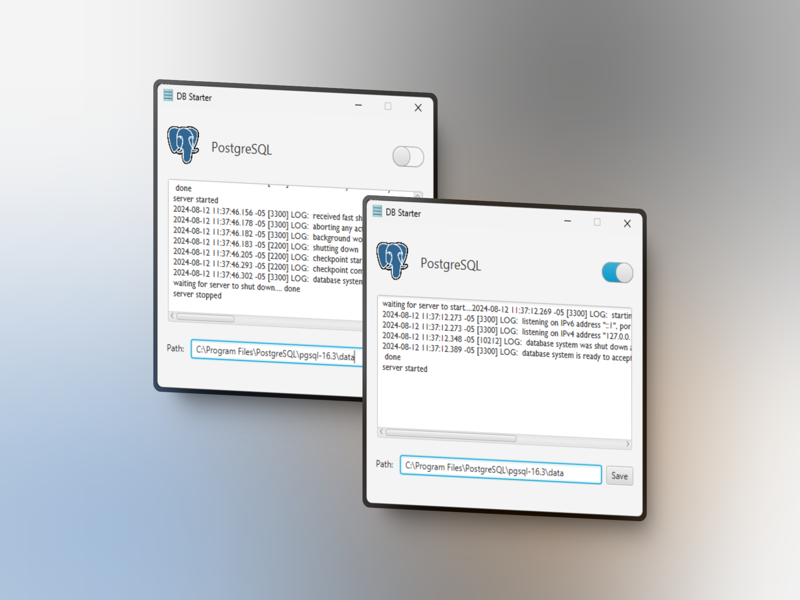

# DB Starter

A simple JavaFX application to launch PostgreSQL database engine.

Start and stop PostgreSQL database engine from the application.



## Installation

1. Download the latest release from the [releases page](https://github.com/oliver-castillo/db-starter/releases/tag/JAR)
   or [here](https://github.com/oliver-castillo/db-starter/releases/download/JAR/db-starter.jar).
2. Open the terminal and navigate to the directory where you downloaded the file.
3. Run the following command to start the application:

```
java -jar db-starter.jar
```

Be sure to replace `db-starter.jar` with the actual name of the file you downloaded, if it's different.
Also, make sure you have Java 17 or higher installed on your system.

## Usage

1. Open the application.
2. Set the path to the PostgreSQL cluster folder (usually `C:\Program Files\PostgreSQL\data`).
3. Click the switch button to start or stop the PostgreSQL database engine.

Now you can connect to the PostgreSQL database using any SQL client or database management tool like pgAdmin, DBeaver or
similar.

This tool is meant to start and stop the PostgreSQL database engine, not to manage the database itself. If you need to
configure the username, password, or other settings for the database, you should look for specific instructions for that
purpose.

## Contributing

Contributions are welcome! Please open an issue or submit a pull request.

## License

This project is licensed under the MIT License - see the [LICENSE](LICENSE) file for details.